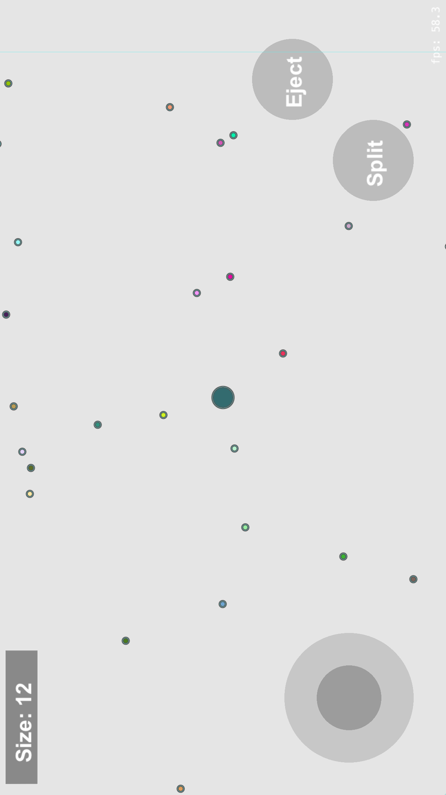
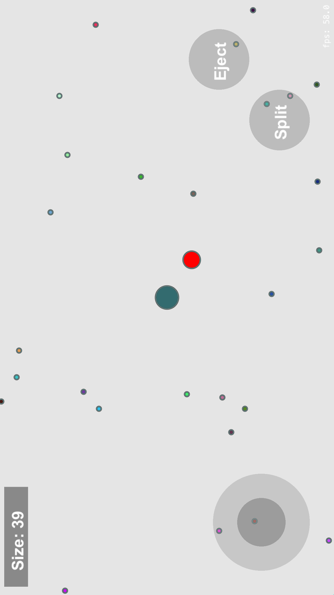
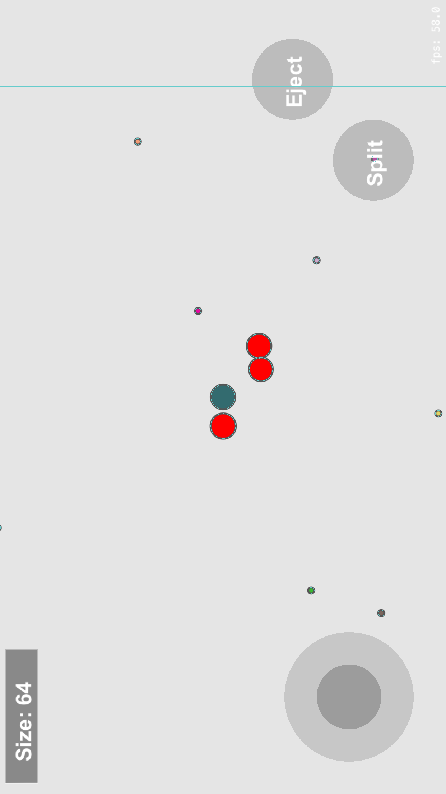

# iAgar_iOS
## Intro
A clone of the popular online game agar.io using SpriteKit and a basic physics engine to simulate a blob collecting mass from other blobs and splitting into two.

## Installation
No additional installation efforts needed. This app utilizes the following frameworks:
* [SpriteKit](https://developer.apple.com/spritekit/) - game driver
* [Physics bodies](https://developer.apple.com/documentation/spritekit/skphysicsbody) - game physics

## Images

